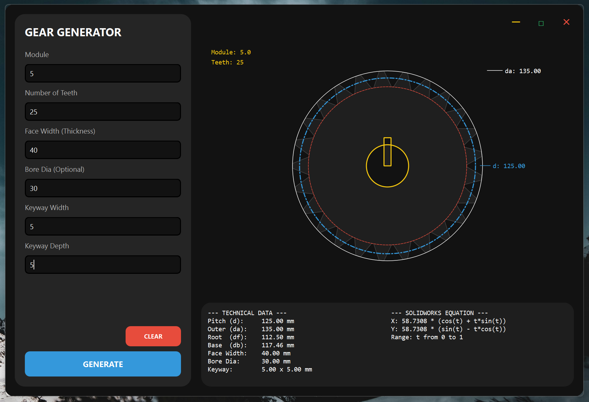

# ⚙️ Gear Generator v2.0.0


**Gear Generator** is a specialized engineering tool designed to simplify the calculation and visualization of involute gears. Built for mechanical engineers, hobbyists, and SolidWorks users, it provides real-time geometry previews and automated equation generation for CAD modeling.

---

### 🚀 What's New in v2.0.0?

The "Global Release" marks a significant leap from the initial version. 

*   **Global Language Support:** Entire UI and technical documentation migrated to English for international accessibility.
*   **Integrated Engineering Elements:** Added Bore Diameter and Keyway (Width/Depth) calculations with real-time visual merging.
*   **Modern UI/UX:** A complete dark-themed dashboard redesign using PyQt6 for a professional look and feel.
*   **Enhanced Precision:** Improved algorithm for involute curve parameters and SolidWorks equation accuracy.
*   **Validation Logic:** Integrated strict numeric validation to prevent calculation errors.

---

### 🛠 Key Features

*   **Real-time Preview:** Visualize your gear as you type. Includes Pitch, Root, and Tip circle displays.
*   **SolidWorks Integration:** Generates copy-paste ready "Equation-Driven Curve" parameters (X, Y equations).
*   **Technical Dashboard:** Instant calculation of Pitch Diameter (d), Outside Diameter (da), Root Diameter (df), and Base Diameter (db).
*   **Keyway & Bore Support:** Specifically designed for shaft-mounted gear modeling.

---

### 📸 Visuals

| Dashboard View | Technical Preview |
| :--- | :--- |
|  |  |

---

### 💻 Installation

1.  **Clone the repository:**
    ```bash
    git clone [https://github.com/yavuzelumut-bot/sw-involute-gear-calculator.git](https://github.com/yavuzelumut-bot/sw-involute-gear-calculator.git)
    ```
2.  **Install dependencies:**
    ```bash
    pip install PyQt6
    ```
3.  **Run the application:**
    ```bash
    python "gear-calculator v2.0.0.py"
    ```

---

### 📐 Usage for SolidWorks

1.  Calculate your gear in the app.
2.  In SolidWorks, go to **Equation Driven Curve**.
3.  Copy the **X** and **Y** equations from the "SolidWorks Equation" panel.
4.  Set the range `t` from `0` to `1`.
5.  Mirror and pattern the curve to complete your gear tooth profile.

---

### 📜 License

Distributed under the MIT License. See `LICENSE` for more information.

---

### 🤝 Contact

Project Link: [https://github.com/yavuzelumut-bot/sw-involute-gear-calculator](https://github.com/yavuzelumut-bot/sw-involute-gear-calculator)