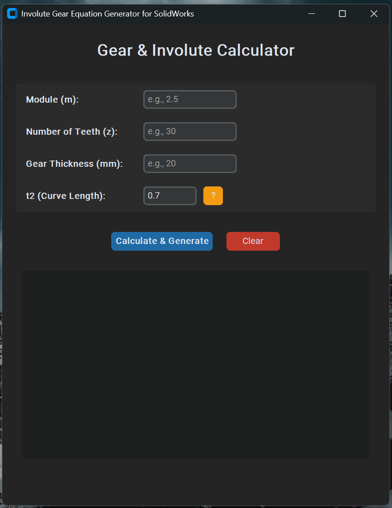
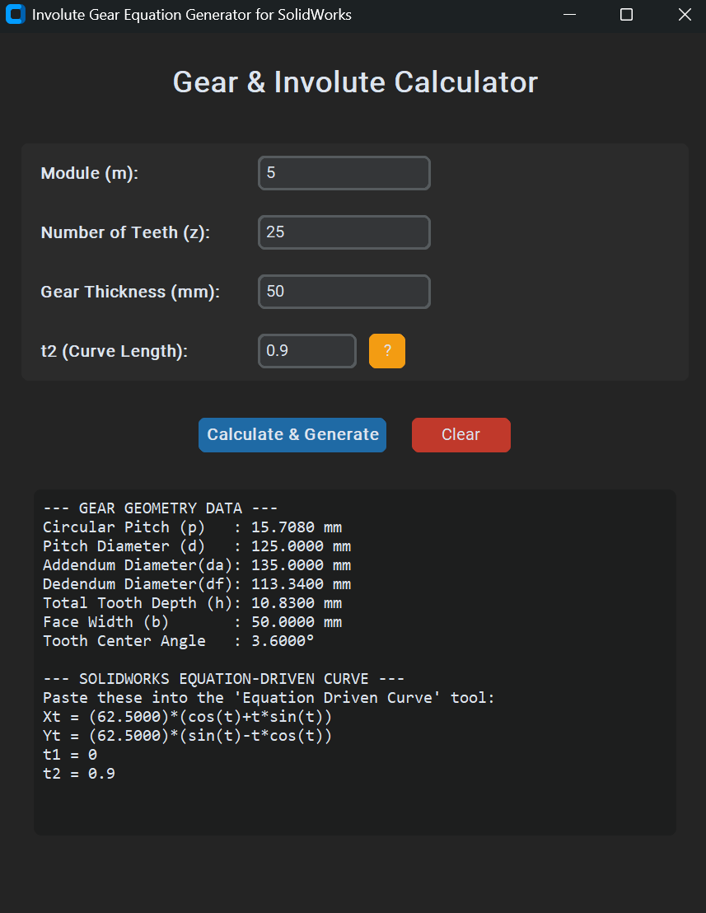
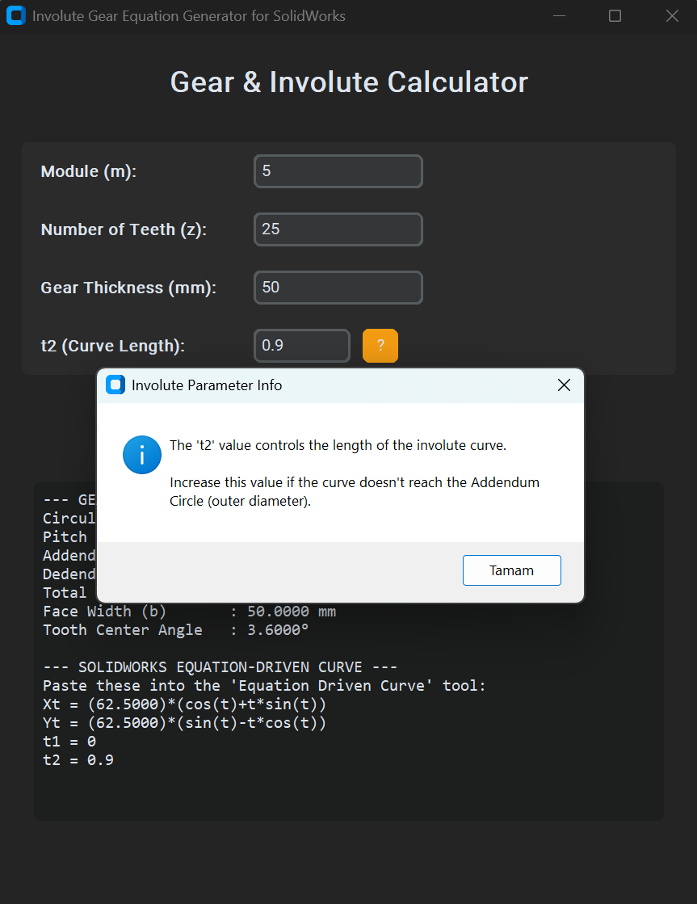

# SolidWorks Involute Gear Equation Generator

This tool is a Python-based application designed for mechanical engineers and designers. It calculates essential gear geometry and generates the precise equations required to create an involute gear profile in SolidWorks.

## Features
* **Geometric Calculations:** Automatically calculates Circular Pitch, Pitch Diameter, Addendum/Dedendum Diameters, and more.
* **SolidWorks Integration:** Generates `Xt` and `Yt` equations ready to be pasted into the "Equation Driven Curve" tool.
* **Modern UI:** Built with `CustomTkinter` for a clean, dark-themed user experience.
* **Easy Navigation:** Supports 'Enter' key navigation between input fields for faster data entry.

## How to Use
1. **Input Values:** Enter the Module (m), Number of Teeth (z), and Gear Thickness.
2. **Adjust t2:** If the involute curve doesn't reach the outer diameter, increase the `t2` value (default is 0.7).
3. **Generate:** Click "Calculate & Generate".
4. **SolidWorks:** Copy the generated equations and paste them into the SolidWorks Equation Driven Curve tool.

## Screenshots

  
  
  

## Requirements
* Python 3.x
* CustomTkinter library (if running from source)

## License
This project is licensed under the MIT License.# sw-involute-gear-calculator
A Python-based GUI tool to calculate gear geometry and generate involute curve equations for SolidWorks.
